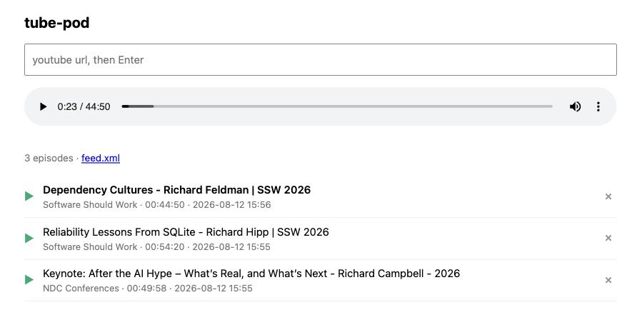

# tube-pod

Turn YouTube videos into a private podcast. Add a link in the browser. tube-pod
downloads the audio, writes an RSS feed, and serves both. Subscribe to the feed
in Apple Podcasts or any other podcast player.

The admin panel uses [buzz](https://github.com/borkdude/buzz).

## Requirements

tube-pod calls `yt-dlp` and `ffprobe`, so install both first.

    brew install yt-dlp ffmpeg

## Run

    bb admin    # the panel and the podcast, on port 8088
    bb dev      # the same, plus an nrepl on 1667

Open http://localhost:8088 for the panel. The feed is at `/feed.xml` and the
audio is under `/audio`.

Set `TUBE_POD_URL` to the address that your phone can reach. The feed puts this
address in each episode link. The default is `http://10.0.1.11:8088`.

    TUBE_POD_URL=http://192.168.1.20:8088 bb admin

## What it does

Paste a YouTube link and press Enter. tube-pod runs `yt-dlp`, and the panel
shows the progress of the download. When it is complete, the episode appears in
the list and in the feed.

Press the play button to listen in the panel. This is browser state, so it
starts at once and it survives a restart of the server.

Press the cross to delete an episode. tube-pod removes the audio file and writes
the feed again.

Each file goes in `audio/`, with the video id as its name. `feed.xml` lists the
files by modification time, newest first. `feed.clj` writes and serves the feed
without the panel.
